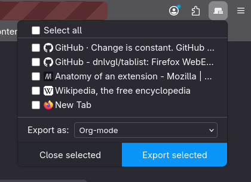
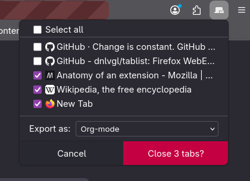

# Tablist Add-on for Firefox

Show all open tabs in a popup. Select or export multiple tabs.

At the moment all tabs of all windows are shown.

## Screenshots




## Features

- Close selected tabs (with confirmation dialog)
- Export selected tab URLs in new tab as Markdown, Org-mode, or plain URLs
- Dark and light mode support
- Components styled after [Firefox Style Guide](https://firefoxux.github.io/StyleGuide/#/welcome)

## Permissions

- tabs: Read and close tabs
- storage: Cache list for exported tabs
- activeTab: Open new active tab to display all exported links

## Development

Install the [web-ext](https://developer.mozilla.org/en-US/docs/Mozilla/Add-ons/WebExtensions/Getting_started_with_web-ext) command line tool

```sh
$ npm install --global web-ext
$ web-ext run
```

To create a build and sign

``` sh
$ web-ext build
$ web-ext sign --channel=listed --amo-metadata=./amo.json --api-key=$AMO_JWT_ISSUER --api-secret=$AMO_JWT_SECRET
```

web-ext build`

### How to debug / inspect

1. Enable debugging in Firefox under `about:debugging`
2. Go to `This Firefox`
3. Check for `Tablist` and click `Inspect`
4. In the Inspect window go to the 3 dot menu and check `Disable Popup Auto-Hide`

## Usage 

Unsigned addons can only be installed in the Developer Edition or Nightly

1. Go to `about:config`
2. Set `xpinstall.signatures.required` to `false`
3. Load the extension via `about:addons` - Install Add-on From File

## Misc

Icons from [Firefox Photon Icons](https://design.firefox.com/icons/viewer/)

## Todo

- [x] Fix missing tab fallback icon
- [x] Export links as plain list, Markdown, or Org-mode
- [x] Cleanup CSS, move values to variables
- [x] Fix overflowing long link names
- [x] Nicer spacing
- [ ] fix min width when no long urls present
- [ ] fix button text color in light mode
- [ ] Publish

### Maybe

- [ ] Update to Acorn design system: https://acorn.firefox.com/latest/home/acorn-aRSAh0Sp
- [ ] Update to manifest v3
